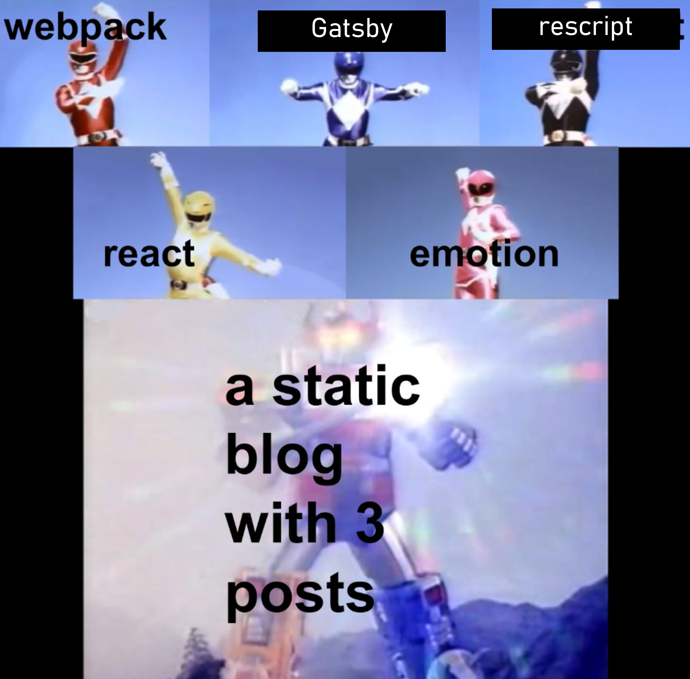

<!-- AUTO-GENERATED-CONTENT:START (STARTER) -->
<p align="center">
  <a href="https://www.gatsbyjs.com">
    
  </a>
</p>
<h1 align="center">
  Gatsby's blog starter + ReScript
</h1>

Yet-another


My ReScript port of `gatsby-starter-blog`.

## 🚀 Development

```shell
cd gatsby-starter-blog-rescript/
yarn re:start

# then open another terminal and do:
yarn dev
```

1.  **Open the source code and start editing!**

    Your site is now running at `http://localhost:8000`!

    _Note: You'll also see a second link: _`http://localhost:8000/___graphql`_. This is a tool you can use to experiment with querying your data. Learn more about using this tool in the [Gatsby tutorial](https://www.gatsbyjs.com/tutorial/part-five/#introducing-graphiql)._

    Open the `my-blog-starter` directory in your code editor of choice and edit `src/pages/index.js`. Save your changes and the browser will update in real time!
